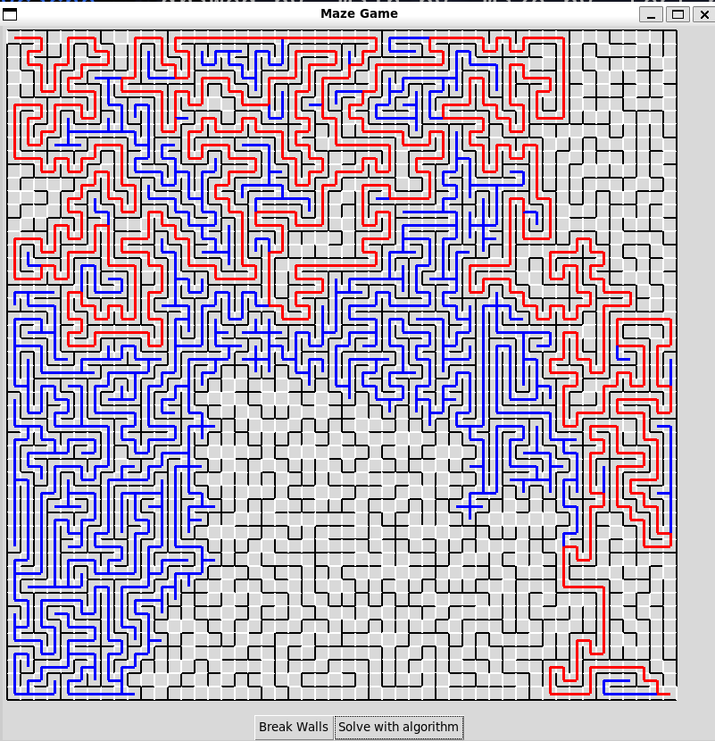

# Maze Generator and Solver

This is a guided project from the Boot.dev curriculum and coded soley by me. [Boot.dev](boot.dev)

## How to use

To use this program, you can just clone the repo. The only dependency is the Tkinter module, which most versions
of Python should have. Finally run `python main.py` and then you should be up and running!

## Organization of the code

Firstly, `test.py` hold unit testing for most of the important logic. It tests without a GUI and uses the `unittest`
module from Python. As you add more logic, add more tests and run `python test.py` for regression testing.

`maze.py` is where you'll be doing most of the customizing for different results with your mazes. It also has the 
heavy lifting logic for generating and solving the maze if you're curious. 

The `Maze` class takes `x` and `y` for the top left corner of the maze, I generally keep it at 5 so it has some padding from the window.
`num_rows` and `num_cols` are the number of rows and columns you want respectively. They don't have to be the same
numbers. Finally the `cell_size` params are the size of the cells in pixels.

You will always want to pass a window of `Window` class, and you want to set `seed = False` for randomization.
It might be good to change this at some point though.

Inside the `__init__` you'll find some variables for controlling how everything executes. Each speed variable will be in seconds
and will determine the amount of time between each "step". `solve_speed_seconds` is for how long it takes between each step of solving.
`break_walls_seconds` is for how long the program waits between breaking walls down. `create_speed_seconds` is the speed 
it takes to build the maze at the beginning.

Generally, you do want some pause between actions since it gives time to visualize the algorithms at work. As for the create
speed, you don't really want any delay if the maze is bigger than 10x10. If you're feeling really enthusiastic, you could 
implement some way for the delay seconds to scale with the size of the maze.

## Implementation of the solving algorithms

I implemented recursive DFS as the primary algorithm and it tracks depth to make sure it doesn't recurse too far.
In the event that it recurses too far, it switches to `_solve_iteratively`. Here it implements a stack and a history stack 
for back tracking. If it finds only dead ends, it returns `False` and returns to a recursive approach, else returns `True`
and ends the solving just like the recursive method.
